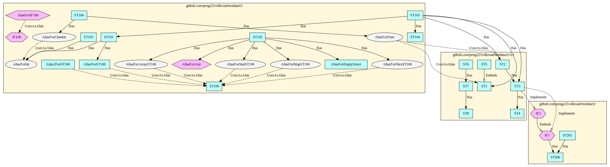
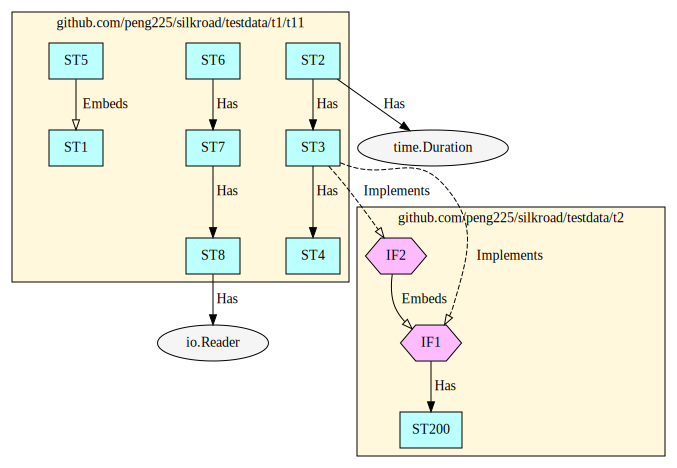

# Silkroad

Silkroad is a tool to analyze dependencies between Go packages.
Silkroad outputs the result as a dot file for Graphviz.

## How to build

```sh
go build
```

## Example

There are test files in `testdata` directory. You can run Silkroad for the directory as follows.

```sh
./silkroad -p testdata -o test.dot
```

Here is an example graph.


You can eliminate the objects from external packages as follows.

```sh
./silkroad -p testdata -o test2.dot --ignore-external --go-mod-path .
```

Here is the resulting graph. You can see that `time.Duration` and `io.Reader` do not exist.



You can select packages as follows.

```sh
./silkroad -p testdata --package-pattern ./t1/...,./t2 -o test3.dot
```

Here is the resulting graph. You can see that `t3` does not exist.

