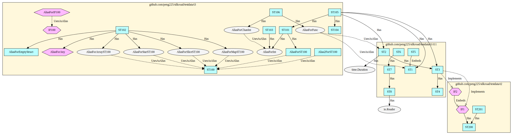

# Silkroad

Silkroad is a tool to analyze dependencies between Go packages.
Silkroad outputs the result as a dot file for Graphviz.

## How to build

```sh
go build
```

## Example

There are test files in `testdata` directory. You can run Silkroad for the directory as follows.

```sh
./silkroad -p testdata -o test.dot
```

Here is an example graph.

